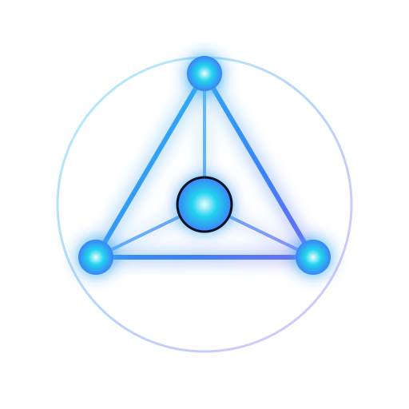
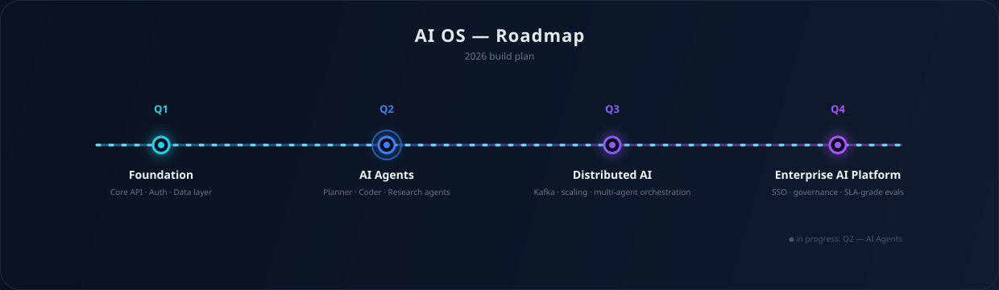

 

<h3>AI OS — The Operating System for Artificial Intelligence</h3>

 

Hyderabad, India

### About

I design and build production-grade AI systems — not notebooks, not demos. My work sits at the intersection of large language models, agentic architectures, retrieval infrastructure, and the backend/cloud engineering required to make all of it reliable at scale.

I'd rather ship one system deep enough to survive contact with production than fifty projects that don't.

<table>
<tr><td><b>Role</b></td><td>Applied AI Engineer · ML Engineer · LLM Engineer</td></tr>
<tr><td><b>Focus</b></td><td>Agentic systems, RAG infrastructure, AI platform engineering</td></tr>
<tr><td><b>Based in</b></td><td>Hyderabad, India</td></tr>
<tr><td><b>Currently building</b></td><td><a href="#ai-os">AI OS</a></td></tr>
</table>

### Mission

> Build intelligent systems that solve real-world problems.

The goal isn't a bigger model — it's a system that reasons, retrieves, remembers, and holds up under real traffic, real failure modes, and real users.

<h3 id="ai-os">AI OS</h3>

**AI OS** is an end-to-end applied AI platform — a single, unified system rather than a portfolio of disconnected demos. It brings together every layer a real AI product needs to run in production:

| Layer | What it covers |
|---|---|
| **Reasoning** | Large language models, multi-agent orchestration, tool use |
| **Knowledge** | Retrieval-augmented generation, embeddings, vector search, memory |
| **Platform** | FastAPI services, async workflows, event streaming |
| **Infrastructure** | Docker, Kubernetes, cloud-native deployment |
| **Operations** | Evaluation harnesses, monitoring, observability, AI security |

### Architecture

<picture>
  <source media="(prefers-color-scheme: dark)" srcset="assets/architecture-dark.svg">
  <source media="(prefers-color-scheme: light)" srcset="assets/architecture.svg">
  
</picture>

Requests flow from the client through a FastAPI gateway into the **AI Agent Hub**, which orchestrates a Planner, Coder, and Research agent against a shared memory and RAG layer backed by a vector database. Postgres, Redis, and Kafka handle state, caching, and event streaming; every request is measured through evaluation and monitoring before the whole system ships on Docker + Kubernetes.

### Tech Stack

**Languages**

**AI / ML**

&nbsp;

**Backend & Platform**

**Data & Retrieval**

&nbsp;

**Cloud & Infrastructure**

### Currently Learning

- Multi-agent orchestration patterns and inter-agent memory sharing
- LLM inference optimization and self-hosted model serving
- Evaluation-driven development for non-deterministic systems
- Distributed event-driven architectures with Kafka

### Roadmap

### Featured Technologies

`FastAPI` · `LangGraph` · `RAG` · `Vector Search` · `PostgreSQL` · `Redis` · `Kafka` · `Docker` · `Kubernetes`

### GitHub Analytics

<picture>
  <source media="(prefers-color-scheme: dark)" srcset="https://raw.githubusercontent.com/ShahhNasir/ShahhNasir/output/assets/snake-dark.svg">
  <source media="(prefers-color-scheme: light)" srcset="https://raw.githubusercontent.com/ShahhNasir/ShahhNasir/output/assets/snake.svg">
  
</picture>

Snake renders after <code>.github/workflows/snake.yml</code> runs once on the default branch.

### Contact

### Philosophy

> Great AI engineers don't just train models — they build reliable, scalable, intelligent systems that hold up in the real world.

 

© 2026 Nasir Hussain — built and maintained as part of AI OS

